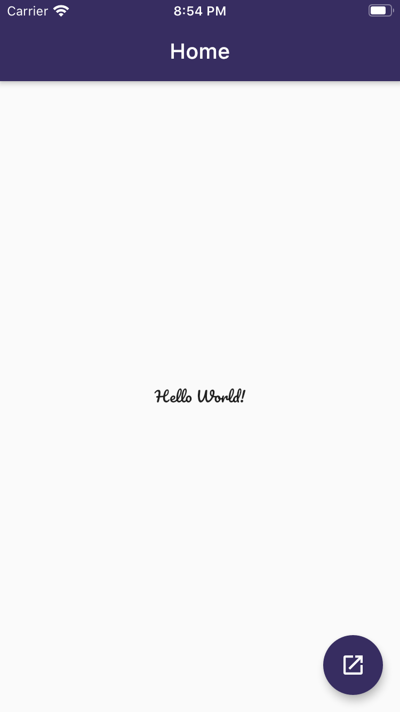

# Flutter Boilerplate

<p>
  
</p>

## Getting Started

For help getting started with Flutter, view online
[documentation](https://flutter.io/).

#### 1. Clone the repo

```sh
$ git https://github.com/danish1023/flutter_boilerplate.git
$ cd flutter_boilerplate
```

#### 2. Run the app

```sh
$ flutter run
```
